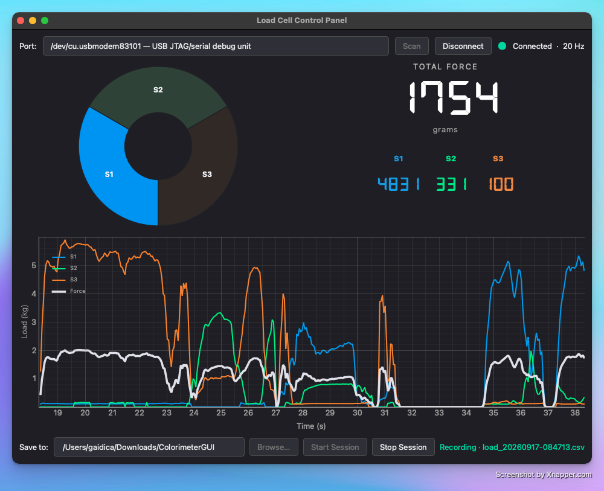

# ColorimeterGUI

A desktop control panel for a **three-sector force sensor** mounted like a Konica Minolta colorimeter aperture. The Python app talks over USB serial to a **Neurotech Hub Raven Node**, shows live sector load and total force in **grams**, and can record sessions to CSV.

| | |
|---|---|
| **Microcontroller** | [Hublink Node Raven](https://github.com/Neurotech-Hub/Hublink-Node-Raven) — multipurpose ESP32-S3 wireless module |
| **Force sensor** | [Ohmite FSP03CE](https://www.digikey.com/en/products/detail/ohmite/FSP03CE/9383877) — size-compatible with the Konica Minolta colorimeter |
| **3D design** | [Fusion 360 model](https://a360.co/4rdJHkh) — mechanical housing / mount |



---

## What you get

- **Live total force** (large grams readout) plus S1 / S2 / S3 sector values  
- **Donut map** of pressure across the three sectors  
- **Time-series plot** of sectors + total force (0–6000 g)  
- **Serial connect** — scan ports, connect / disconnect at 115200 baud  
- **Session recording** — start/stop in the footer; saves `load_YYYYMMDD-HHMMSS.csv` with `Datetime` (ms) and `Force` (grams)

Firmware lives in [`arduino/ColorimeterLoadSensor`](arduino/ColorimeterLoadSensor). It averages ADC samples for 50 ms, converts to grams, and streams CSV lines the GUI already understands.

---

## Repository layout

```text
ColorimeterGUI/
├── README.md
├── run.py                      # easiest way to launch the app
├── requirements.txt
├── pyproject.toml
├── docs/
│   └── load_gui.png            # GUI screenshot
├── scripts/
│   └── install_fonts.py        # downloads DSEG 7-segment font into the package
├── arduino/
│   └── ColorimeterLoadSensor/  # Raven firmware (Arduino)
│       └── ColorimeterLoadSensor.ino
└── src/colorimeter_gui/        # Python GUI package
    ├── app.py                  # main window
    ├── serial_worker.py        # USB serial reader thread
    ├── donut_widget.py         # sector donut
    ├── session.py              # CSV session recording
    ├── fonts.py                # bundled digital font loader
    └── assets/fonts/           # DSEG TTFs (after install_fonts.py)
```

---

## Hardware

### Raven Node (ESP32-S3)

Use Neurotech Hub’s **[Hublink Node Raven](https://github.com/Neurotech-Hub/Hublink-Node-Raven)** — a multipurpose ESP32-S3-based wireless module. This project uses its USB serial port and analog pins `A0`–`A3`.

| Signal | Raven pin |
|--------|-----------|
| Sensor wiper (ADC) | `PIN_A0` |
| Sector 1 drive | `PIN_A1` |
| Sector 2 drive | `PIN_A2` |
| Sector 3 drive | `PIN_A3` |

Flash [`arduino/ColorimeterLoadSensor/ColorimeterLoadSensor.ino`](arduino/ColorimeterLoadSensor/ColorimeterLoadSensor.ino) with the Raven / ESP32-S3 board package and the Hublink Node Raven library installed.

### Force sensor (Ohmite FSP03CE)

The sensing element is an **[Ohmite FSP03CE](https://www.digikey.com/en/products/detail/ohmite/FSP03CE/9383877)** three-sector force sensor, sized for Konica Minolta colorimeter–style apertures. A common **wiper** plus three **drive** terminals map to Raven `A0`–`A3`.

Mechanical parts / fit: **[3D design on Fusion (a360.co)](https://a360.co/4rdJHkh)**.

### Circuit schematic

One sector is read at a time: that drive line is set **LOW**, the others **HIGH**. A pull-up to 3.3 V and a small RC into the ADC form the front-end:

```text
                         3.3V (VDD)
                            |
                         3.3 kΩ          pull-up
                            |
      FSP03CE wiper --------+---- 330 Ω ---- PIN_A0 (ADC)
                            |
                         0.1 µF          to GND
                            |
                           GND

         sector 1 ------------------- PIN_A1
         sector 2 ------------------- PIN_A2
         sector 3 ------------------- PIN_A3
```

| Part | Role |
|------|------|
| **3.3 kΩ** to VDD | Pull-up; forms a divider with the active sector resistance |
| **330 Ω** | Series isolation into the ADC |
| **0.1 µF** | Filter from `PIN_A0` to GND |

Unloaded, the ADC sits near full scale (~4095). Pressing a sector lowers resistance to the active drive and pulls the reading down. Firmware only reports load when `ADC < 3900`, using:

```text
Load [g] = 0.0015649·ADC² − 11.5986·ADC + 21590.5
```

Total **force** on the wire is the average of the three sector loads (grams). Each serial line is sent every **50 ms** after on-device averaging.

---

## Install (Python + venv)

Requires **Python 3.9+** (3.11+ preferred).

```bash
cd ColorimeterGUI
python3 -m venv .venv
source .venv/bin/activate          # Windows: .venv\Scripts\activate
pip install --no-compile -r requirements.txt
pip install --no-compile -e .
python scripts/install_fonts.py    # optional but recommended (7-segment readout)
```

> **macOS tip:** System Python 3.9 may need `--no-compile` so pip does not choke on a PySide6 Android recipe template. Using the project’s `.venv` Python (not Homebrew’s `python3` path alone) avoids `ModuleNotFoundError: colorimeter_gui`.

`install_fonts.py` downloads **DSEG7 Classic** (OFL) into `src/colorimeter_gui/assets/fonts/`. It is safe to re-run; it skips if the files are already there.

---

## Run

With the venv activated:

```bash
python run.py
```

Or:

```bash
python -m colorimeter_gui
# or:  .venv/bin/python run.py
```

---

## Using the control panel

1. Plug in the Raven over USB and power the sensor circuit.  
2. Click **Scan**, select the Raven port (often `/dev/cu.usbmodem…` on macOS).  
3. Click **Connect** — the donut, grams readout, and plot should update (~20 Hz).  
4. **Sessions (footer):** set a save folder (**Browse…**), then **Start Session** / **Stop Session**.  
   - Files: `load_YYYYMMDD-HHMMSS.csv`  
   - Columns: `Datetime` (local time, millisecond precision), `Force` (grams)  
   - Default folder: `~/Documents/ColorimeterGUI`  
5. Click **Disconnect** when finished (an open session is stopped automatically).

---

## Serial protocol (reference)

Baud **115200**. One CSV line every 50 ms:

```text
millis,d1,d2,d3,force
12345,120,80,200,133
```

| Field | Meaning |
|-------|---------|
| `millis` | Device time (ms) |
| `d1`…`d3` | Sector loads (grams) |
| `force` | Mean of d1–d3 (grams) |

No host commands are required; the stream is Raven → PC only.
